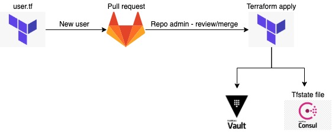

## TF_VAULT

TF_VAULT implements the `vault-terraform-provider` to configure the DOU Vault Service.

### # Contributors
- Cristian Ramirez <cristian.ramirez@digitalonus.com>
- Bernardo Garza <bernardo.garza@digitalonus.com>
- Marin Salinas <marin.salinas@digitalonus.com>

### # Services available in `dou-vault`

- Dynamic Secrets for the following engines
    - AWS
      - attaches a devops iam role and generates the dynamic keys

    - GCP
      - attaches a list of roles and generates a token

    - Azure (still in proceses of enabling)

- KV secret engine (version 1)
    - under the secret/ path + {{ entity_name }} which will be a personal path scoped to each user

- Transit Secret Engine for Encryption as a Service
  - 3 keys generated for each team
    - devops
    - development
    - admin

- multi authentication processes which uses identity entity and identity groups to assign the proper policies no matter what authentication process you use.
  - github
  - userpass // for testing purposes
  - ldap // coming next

---
### # **Workflow of how to add a new vault user**

    1.- Update users.tf

    2.- Add your user-entity name and github name and details

    3.- Create Pull request

    4.- Wait for review/merge

    5.- Login into vault

---
### # **How to login into vault**

So far we have enabled two authentication methods, Github and userpass.

- Github: You will need your personal github token to login, make sure that your github account is included on the DigtalOnUs github organization.

- Userpass: has been enabled this feature will not be used, since is just for testing purposes.

#### Login using CLI

 - Github: vault login -method=gitgub

#### Login using UI

Go to vault URL (example: https://vault.douvault.com:8200). You will se login options for vault. Select the one that you would like to use to login and provide required information. e.g github auth method.

---
### # **How to generate AWS, GCP and azure keys**

After doing a succesfully logging into vault you will be able to generate access keys for AWS, GCP and Azure.

**AWS:**

    vault read aws/creds/devops

**GCP:**

    vault read gcp/token/devops

**Azure:**

    vault read azure/creds/devops

---
### Terraform Vault modules structure

We decided to create modules for the features that will be integrated into Vault. So far the features that were included are:

    - Vault Auth Method
    - Vault secret engines
    - Groups and entities
    - Vault Policies
    - Generic endpoints

You will be able to call these modules in order to implement these features into Vault. We will explain below how to use each one of these modules. Also you can take as a reference the file "main.tf" under the root folder and see how we call these modules in order to add these features into Vault.

### Vault Auth Methods

The vault auth methods are located under "auth_methods" folder. At this moment we have just enabled github and userpass auth method. Terraform vault provider was used to creat these auth methods.

                variable "enable_github" {
                default = false
                }
                variable "github_token_policies" {
                default = []
                }

                resource "vault_github_auth_backend" "example" {
                count = var.enable_github ? 1 : 0

                organization   = "DigitalOnUs"
                token_policies = var.github_token_policies
                }

                output "github_accessor" {
                value = var.enable_github ? vault_github_auth_backend.example[0].accessor : ""
                }

Taken as an example, the github method above it is important that you specify the organization and the policies attached of that specific auth method.

If you want to create anther auth method for vault, under this folder you should create anothe tf file and using terraform vault provider add the required auth method.

### Vault Secret Engines

To enable vault secret engines you need to go to "secrets" folder. You will see that aws, azure, gcp, transit, kv secret engines have already been created.

                variable "enable_aws_dynamic_secret" {}
                variable "aws_access_key" {}
                variable "aws_secret_key" {}
                variable "aws_region" {}
                variable "aws_roles" {}

                resource "vault_aws_secret_backend" "aws" {
                count = var.enable_aws_dynamic_secret ? 1 : 0

                access_key = var.aws_access_key
                secret_key = var.aws_secret_key
                region     = var.aws_region
                }

                resource "vault_aws_secret_backend_role" "role" {
                count = var.enable_aws_dynamic_secret ? length(var.aws_roles) : 0

                backend = vault_aws_secret_backend.aws[0].path
                name    = var.aws_roles[count.index].name
                credential_type = "iam_user"
                policy_document = file(var.aws_roles[count.index].role)
                }

During vault bootstrap this terraform project should be executed to enable these secret engines. If you would like to add another secret engine, a tf file will have to be created under this folder and use terraform provider to enable to secret engine that you want.

### Add Vault Users

Under users.tf file you will be able to se see the format to add users into vault:

                entity_name = "marin"
                    github_user = "marinsalinas"
                    metadata = {
                    organization = "DigitalOnUs"
                    team         = "devops"
                    is_admin     = false
                    }

You will need to specify the github user. (note: is important that the user is registered on digitalonus github account) and under metadata you will have to provide the organization the users belongs, which team he/she belongs and can specify if the user should be an admin user.

### Add Vault Policies

To add a vault policy into vault you will need to go to the policies folder and create a tf file with the name of the policy you want to create (examle: github.tf). Under this tf file you will use terraform vault provider and create a policy.

                resource "vault_policy" "github" {
                count = var.enable_entity_policy ? 1 : 0

                name   = "github"
                policy = <<EOT
                    path "auth/token/lookup-self" {
                    capabilities = [ "read" ]
                    }
                EOT
                }

As you can see, you can create a vault policy and specify the rules that you want your policy to have. Later on you will be able to attach these policies to specific entities or groups.

### Add Vault Entities

Since we have several auth methods enabled (example: github, userpass) we can create entities that will represent and associate aliases representing each of the accounts as the entity member. You can set additional policies and metadata on the entity level so that both accounts can inherit.

                variable "users" {}
                variable "policies" {}

                variable "enable_github_entity" {
                default = false
                }

                variable "github_accessor" {}

                resource "vault_identity_entity" "entity" {
                count    = var.enable_github_entity ? length(var.users) : 0
                name     = var.users[count.index].entity_name
                policies = var.policies
                metadata = var.users[count.index].metadata
                }

                resource "vault_identity_entity_alias" "github" {
                count          = var.enable_github_entity ? length(var.users) : 0
                name           = var.users[count.index].github_user
                mount_accessor = var.github_accessor
                canonical_id   = vault_identity_entity.entity[count.index].id
                }

As you can see on the example above, a github entity and alias were created. If you want to add another entity, you will have to create another tf file with the entity you would like to create.

### Add Vault Groups

Create a tf file under "groups" folder with the name of the group you want to create (examle: admin.tf). Within the tf file you will create a vault group with terraform vault provider:

                variable "admins_members" {}
                variable "enable_admins_group" {
                    default = false
                }

                resource "vault_identity_group" "admin" {
                count =  var.enable_admins_group ? 1 : 0

                name              = "admin"
                type              = "internal"
                policies          = var.policies.admin
                member_entity_ids = var.admins_members

                metadata = {
                    organization = "DigitalOnUs"
                    team         = "admin"
                }
                }

Under the identity group resource you will specify the policies that should be attached to that group and also especify the members that will belong to that particular group as you can see in the example above for admin group.

### How to run tf_vault code

Required env variables:

    CONSUL_HTTP_TOKEN=... 
    CONSUL_CLIENT_CERT="./files/ca.crt.key" 

    VAULT_CACERT="./files/ca.crt.pem" 
    VAULT_TOKEN=... 
    VAULT_ADDR=https://vault.douvault.com:8200
    
    TF_VAR_aws_access_key=...
    TF_VAR_aws_secret_key=... 
    
    TF_VAR_azure_subscription_id=... 
    TF_VAR_azure_tenant_id=... 
    TF_VAR_azure_client_id=... 
    TF_VAR_azure_client_secret=... 

Then run the appropiate: `terraform commands init | plan | apply`

### # **Adding additional Vault Configurations**

Just follow the conventions used in this repo create a PR and explain the purpose of adding this new configuration.